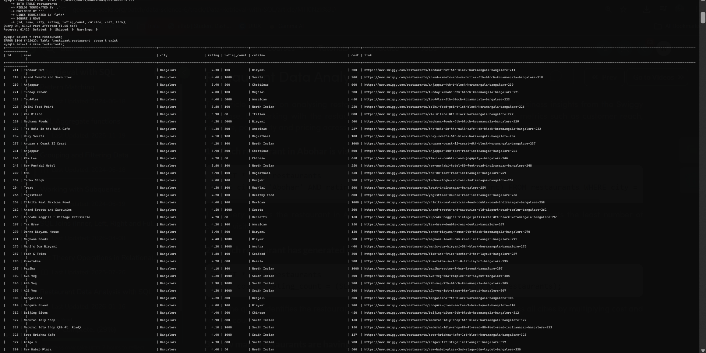

  

# Swiggy Restaurant Data Analysis Using SQL

This project presents an SQL-based analysis of a Swiggy restaurant dataset to derive meaningful insights from restaurant-related information across multiple cities. The dataset contains details such as restaurant names, locations, ratings, number of customer reviews, cuisines offered, average cost, and restaurant links.

Using SQL queries, the data is explored to understand restaurant performance, customer preferences, cuisine trends, and pricing patterns. The analysis helps identify highly rated restaurants, popular cuisines, cities with the largest restaurant presence, and variations in pricing across different locations. It also examines customer engagement through rating counts and highlights restaurants that stand out in terms of popularity and quality.

The dataset includes the following information:

- Restaurant ID
- Restaurant Name
- City
- Customer Rating
- Number of Ratings/Reviews
- Cuisine Type
- Average Cost
- Restaurant Link

Through this analysis, SQL techniques such as filtering, aggregation, grouping, ranking, subqueries, and window functions are applied to transform raw restaurant data into actionable business insights. The project serves as a practical demonstration of how SQL can be used for data exploration, reporting, and decision-making using real-world food delivery platform data.

  

Contributer :-Harikrishnan K
